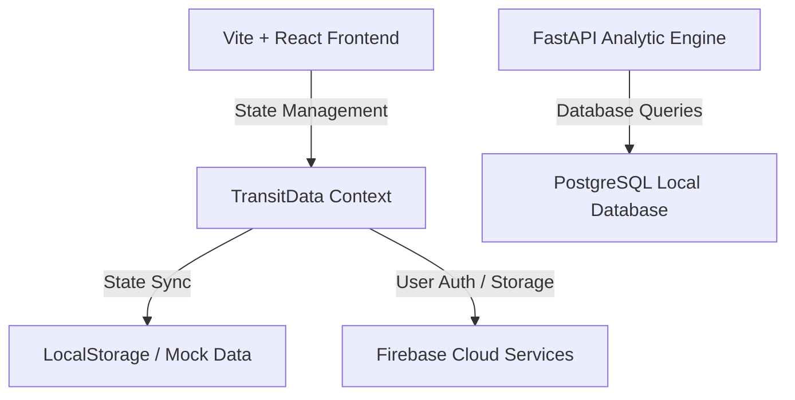

# TransitOps: Smart Transport Operations Platform

**TransitOps** is a real-time fleet, dispatch, and cost management control tower built for the Odoo Hackathon. It acts as an operational dashboard that coordinates dispatch logistics, tracks vehicle health, logs real-time expenses, and enforces strict, dynamic Role-Based Access Control (RBAC).

---

## 🚀 Key Features

### 1. Dynamic Role-Based Access Control (RBAC)
- **Role Selector**: Switch active operator contexts in real-time (e.g., *Operations Lead*, *Fleet Manager*, *Dispatcher*, *Safety Officer*, *Financial Analyst*).
- **Access Control Matrix Grid**: Manage full-access, read-only, or no-access rights dynamically. Changes are immediately reflected across other navigation tabs.
- **Access Alert Blocks**: RESTRICTED layouts appear if a role does not possess permissions to view or write records.

### 2. Maintenance Management
- **Work Orders**: Create, view, and close vehicle maintenance logs.
- **Odometer Updates**: Closing a log automatically triggers odometer status synchronization.
- **Dynamic Action Restrictions**: Hides creation and resolve buttons for read-only roles.

### 3. Fuel & Expenses Tracking
- **Interactive Modals**: Log fuel inputs (liters, cost, date, odometer reading) and general expenses (category, amount, vehicle/trip association).
- **Cost Calculations**: Calculates price-per-liter on the fly and triggers success alerts.

### 4. Depot Settings Configuration
- Change depot names, currency formats (₹, $, €, £), and distance units (km, mi) globally.

### 5. Firebase & Authentication Integration
- Client-side authentication handlers.
- Firestore synchronization for user profiles.
- Profile photo upload utilizing Firebase Storage.

---

## 🛠️ Technology Stack & Architecture



- **Frontend**: React, Vite, Tailwind CSS v4, Framer Motion, Lucide Icons, Recharts.
- **Backend Database**: PostgreSQL 18.
- **Integrations**: Firebase (Auth, Firestore, Cloud Storage).

---

## 📂 Project Structure

```text
odoo-hackathon/
├── backend/
│   └── db/
│       ├── .env.example          # Template for local PostgreSQL config
│       ├── requirements.txt      # Python database driver dependencies
│       ├── schema.sql            # PostgreSQL DDL table structures
│       ├── seed.sql              # Mock datasets matching frontend metrics
│       └── setup.py              # Automated database initializer runner
├── src/
│   ├── app/
│   │   ├── App.jsx               # Navigation router & shell provider
│   │   └── transit-data.jsx      # Global database state and hooks
│   ├── components/
│   │   ├── layout/               # Topbar, Sidebar, and AppShell
│   │   └── ui/                   # Shared buttons, modals, cards, select
│   ├── features/
│   │   ├── auth/                 # LoginPage
│   │   ├── expenses/             # ExpensesPage, Log modals
│   │   ├── maintenance/          # MaintenancePage, work order actions
│   │   └── settings/             # SettingsPage, Depot, RBAC permissions
│   └── lib/
│       ├── auth.js               # Firebase auth wrappers
│       ├── firebase.js           # Firebase app initializations
│       ├── firestore.js          # Firestore profile document helpers
│       ├── storage.js            # Firebase photo upload hooks
│       └── utils.js              # Helpers for currency and date formatting
├── index.html
├── package.json
└── vite.config.js
```

---

## 💾 Database Schema (PostgreSQL)

The relational schema implements core data integrity checks directly at the database layer:

| Table | Primary Key | Keys / References | Key Check Constraints & Indices |
| :--- | :--- | :--- | :--- |
| **`users`** | `id` (Serial) | | `email` (Unique), Role constraint checks |
| **`vehicles`** | `id` (VARCHAR) | | `reg_number` (Unique Index), Odometer/capacity range checks |
| **`drivers`** | `id` (VARCHAR) | | `license_number` (Unique), Safety score checks |
| **`trips`** | `id` (VARCHAR) | `vehicle_id`, `driver_id` | Status range limits, weight bounds |
| **`maintenance_logs`** | `id` (VARCHAR) | `vehicle_id` | Status flags (`Open`, `Closed`) |
| **`fuel_logs`** | `id` (VARCHAR) | `vehicle_id` | Metric bounds (positive liters/amounts) |
| **`expenses`** | `id` (VARCHAR) | `vehicle_id` | Category filters (`Toll`, `Fuel`, etc.) |

---

## 🏃 Quick Start Guide

### 1. Launch the Frontend Dev Server
Run the following commands in the project root directory:
```bash
# Install NPM dependencies
npm install

# Start Vite developer server
npm run dev
```

### 2. Configure & Seed the PostgreSQL Database
Before running, make sure your local PostgreSQL service is running.
```bash
# 1. Navigate to backend database directory
cd backend/db

# 2. Copy the config template
cp .env.example .env

# 3. Open .env and set your DB_PASSWORD (e.g. DB_PASSWORD=lmao)

# 4. Activate Python virtual environment from root
cd ../..
.\backend\.venv\Scripts\activate

# 5. Run the initializer script
python backend/db/setup.py
```
This script will automatically:
1. Connect to PostgreSQL and create the `transitops` database.
2. Initialize tables (`schema.sql`).
3. Seed the tables with mockup values (`seed.sql`).
